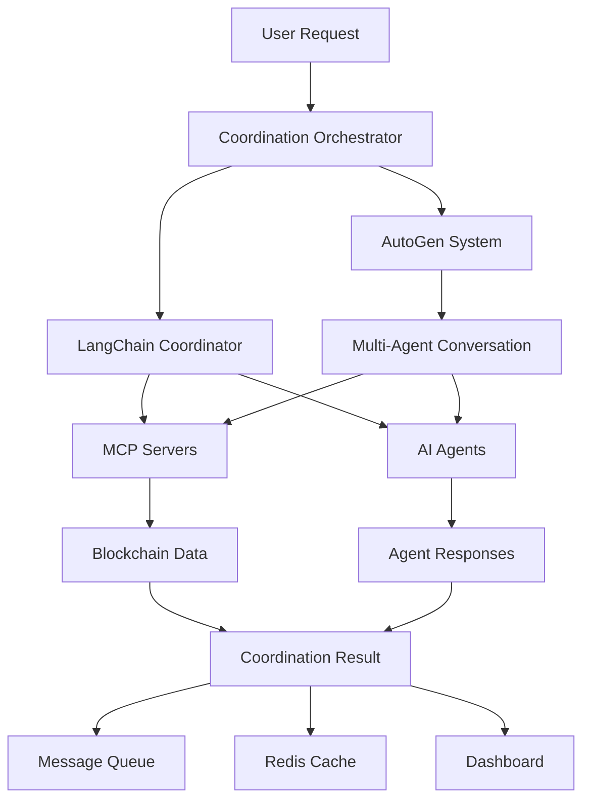

# Docker Coordination System for MCP Servers and AI Agents

## Overview

This system provides complete coordination between:
- **21 MCP Servers** (Model Context Protocol servers for blockchain operations)
- **10 AI Agents** (Specialized agents for different tasks)
- **LangChain** (Intelligent agent coordination)
- **AutoGen** (Multi-agent conversations)
- **Infrastructure** (Redis, RabbitMQ, PostgreSQL, monitoring)

## Architecture

```
┌─────────────────────────────────────────────────────────────────┐
│                    Coordination Orchestrator                    │
│                         (Port 8000)                           │
└─────────────────────────┬───────────────────────────────────────┘
                          │
        ┌─────────────────┼─────────────────┐
        │                 │                 │
        ▼                 ▼                 ▼
┌─────────────┐  ┌─────────────┐  ┌─────────────┐
│ LangChain   │  │ AutoGen     │  │ Infrastructure│
│ Coordinator │  │ System      │  │ Services     │
│ (Port 8001) │  │ (Port 8002) │  │ (Redis, etc.)│
└─────────────┘  └─────────────┘  └─────────────┘
        │                 │                 │
        └─────────────────┼─────────────────┘
                          │
        ┌─────────────────┼─────────────────┐
        │                 │                 │
        ▼                 ▼                 ▼
┌─────────────┐  ┌─────────────┐  ┌─────────────┐
│ MCP Servers │  │ AI Agents   │  │ Monitoring  │
│ (21 servers)│  │ (10 agents) │  │ & Dashboard │
│ Port 8100+  │  │ Port 9001+  │  │ Port 8080+  │
└─────────────┘  └─────────────┘  └─────────────┘
```

## Quick Start

### 1. Prerequisites

- Docker and Docker Compose installed
- Python 3.11+
- At least 8GB RAM
- 10GB free disk space

### 2. Environment Setup

```bash
# Clone or navigate to the project directory
cd "c:\Users\Ratanshila\Documents\flash loan"

# Install Python dependencies
pip install -r requirements-coordination.txt

# Set up environment variables (edit .env file)
# Key variables to set:
# - POLYGON_RPC_URL=your_polygon_rpc_url
# - ARBITRAGE_PRIVATE_KEY=your_private_key
# - OPENAI_API_KEY=your_openai_key (optional)
```

### 3. Launch the System

```bash
# Launch everything with one command
python coordination_launcher.py

# Or use Docker Compose directly
docker compose -f docker/docker-compose-coordination.yml up -d
```

### 4. Access the System

Once started, access these interfaces:

| Service | URL | Description |
|---------|-----|-------------|
| **Main Dashboard** | http://localhost:8080 | System overview and control |
| **Coordination API** | http://localhost:8000 | Main coordination endpoint |
| **LangChain Coordinator** | http://localhost:8001 | LangChain agent interface |
| **AutoGen System** | http://localhost:8002 | Multi-agent conversations |
| **Grafana Monitoring** | http://localhost:3000 | System metrics (admin/admin) |
| **RabbitMQ Management** | http://localhost:15672 | Message queue (coordination/coordination_pass) |

## Using the System

### Coordinate Tasks

Send coordination requests to the main API:

```bash
curl -X POST http://localhost:8000/coordinate \
  -H "Content-Type: application/json" \
  -d '{
    "description": "Analyze current arbitrage opportunities across all DEXes and recommend optimal flash loan strategies",
    "priority": "high",
    "timeout": 300
  }'
```

### Example Coordination Workflows

#### 1. Arbitrage Analysis
```bash
curl -X POST http://localhost:8000/coordinate \
  -H "Content-Type: application/json" \
  -d '{
    "description": "Find profitable arbitrage opportunities between QuickSwap and SushiSwap for USDC-WETH pair",
    "agents": ["arbitrage_detector", "market_analyzer", "risk_manager"],
    "mcp_servers": ["price_feed", "dex_aggregator"]
  }'
```

#### 2. Flash Loan Optimization
```bash
curl -X POST http://localhost:8000/coordinate \
  -H "Content-Type: application/json" \
  -d '{
    "description": "Optimize flash loan parameters for maximum profit with minimal risk",
    "agents": ["flash_loan_optimizer", "gas_optimizer", "route_optimizer"],
    "mcp_servers": ["flash_loan", "evm_interaction"]
  }'
```

#### 3. Risk Assessment
```bash
curl -X POST http://localhost:8000/coordinate \
  -H "Content-Type: application/json" \
  -d '{
    "description": "Assess risks for executing $10,000 flash loan arbitrage on Polygon",
    "agents": ["risk_manager", "security_analyst", "compliance_checker"],
    "mcp_servers": ["price_feed", "evm_interaction"]
  }'
```

## System Components

### MCP Servers (Ports 8100-8120)

| Server | Port | Purpose |
|--------|------|---------|
| **Price Feed** | 8100 | Real-time DEX price aggregation |
| **Flash Loan** | 8101 | Aave flash loan operations |
| **DEX Aggregator** | 8102 | Multi-DEX liquidity aggregation |
| **EVM Interaction** | 8103 | Ethereum/Polygon blockchain interaction |

### AI Agents (Ports 9001-9010)

| Agent | Port | Purpose |
|-------|------|---------|
| **Arbitrage Detector** | 9001 | Identify arbitrage opportunities |
| **Risk Manager** | 9002 | Assess and manage risks |
| **Flash Loan Optimizer** | 9003 | Optimize flash loan parameters |
| **Transaction Executor** | 9004 | Execute blockchain transactions |
| **Market Analyzer** | 9005 | Analyze market trends and data |
| **Route Optimizer** | 9006 | Optimize transaction routes |
| **Gas Optimizer** | 9007 | Minimize gas costs |
| **Liquidity Monitor** | 9008 | Monitor DEX liquidity pools |
| **Security Analyst** | 9009 | Security vulnerability scanning |
| **Compliance Checker** | 9010 | Regulatory compliance verification |

### Coordination Services

#### LangChain Coordinator (Port 8001)
- Intelligent task coordination using LangChain agents
- Natural language processing for task interpretation
- Tool-based interaction with MCP servers and agents

#### AutoGen System (Port 8002)
- Multi-agent conversations and decision making
- Collaborative problem solving between specialized agents
- Group chat management for complex coordination tasks

## Communication Flow



## Monitoring and Logging

### View Logs
```bash
# All services
docker compose -f docker/docker-compose-coordination.yml logs -f

# Specific service
docker compose -f docker/docker-compose-coordination.yml logs -f coordination_orchestrator

# System health
python coordination_launcher.py --health
```

### Metrics and Monitoring
- **Grafana**: http://localhost:3000 (admin/admin)
- **Prometheus**: http://localhost:9090
- **Health Monitor**: Automatic health checks every 30 seconds

## Management Commands

### System Control
```bash
# Launch system
python coordination_launcher.py

# Stop system
python coordination_launcher.py --stop

# Check health
python coordination_launcher.py --health

# View system info
python coordination_launcher.py --info
```

### Docker Commands
```bash
# Start all services
docker compose -f docker/docker-compose-coordination.yml up -d

# Stop all services
docker compose -f docker/docker-compose-coordination.yml down

# Restart specific service
docker compose -f docker/docker-compose-coordination.yml restart coordination_orchestrator

# View service status
docker compose -f docker/docker-compose-coordination.yml ps
```

## Configuration

### Environment Variables

Key configuration in `.env`:

```bash
# Blockchain
POLYGON_RPC_URL=https://your-polygon-rpc-url
ARBITRAGE_PRIVATE_KEY=your_private_key_here
MIN_PROFIT_USD=3.0
MAX_PROFIT_USD=30.0

# AI Services
OPENAI_API_KEY=your_openai_key
OLLAMA_HOST=http://coordination_ollama:11434

# System
LANGCHAIN_ENABLED=true
AUTOGEN_ENABLED=true
LOG_LEVEL=INFO
```

### Service Configuration

- **MCP Servers**: `unified_mcp_config.json`
- **AI Agents**: `ai_agents_config.json`
- **Docker Compose**: `docker/docker-compose-coordination.yml`

## Troubleshooting

### Common Issues

1. **Port Conflicts**
   ```bash
   # Check if ports are in use
   netstat -tulpn | grep :8000
   
   # Change ports in docker-compose-coordination.yml
   ```

2. **Memory Issues**
   ```bash
   # Increase Docker memory limit
   # Docker Desktop -> Settings -> Resources -> Memory
   ```

3. **Service Health Checks**
   ```bash
   # Check individual service health
   curl http://localhost:8000/health
   curl http://localhost:8001/health
   curl http://localhost:9001/health
   ```

4. **Container Logs**
   ```bash
   # View specific container logs
   docker logs coordination_orchestrator
   docker logs mcp_price_feed
   docker logs agent_arbitrage_detector
   ```

### Reset System

```bash
# Complete reset
docker compose -f docker/docker-compose-coordination.yml down -v
docker system prune -f
python coordination_launcher.py
```

## Advanced Usage

### Custom Agent Development

Create custom agents by extending the base agent class:

```python
# In your custom agent file
from ai_agents.base_agent import BaseAgent

class CustomArbitrageAgent(BaseAgent):
    def __init__(self):
        super().__init__("custom_arbitrage")
    
    async def process_task(self, task_data):
        # Your custom logic here
        return {"status": "completed", "result": "Custom processing"}
```

### Custom MCP Servers

Add new MCP servers to `unified_mcp_config.json`:

```json
{
  "servers": {
    "custom_server": {
      "name": "custom_server",
      "type": "python",
      "path": "mcp_servers/custom_server.py",
      "port": 8200,
      "enabled": true
    }
  }
}
```

## Security Considerations

1. **Private Keys**: Never commit private keys to version control
2. **API Keys**: Use environment variables for API keys
3. **Network Security**: Consider using Docker networks for isolation
4. **Access Control**: Implement authentication for production use
5. **Monitoring**: Monitor for unusual activity and failed transactions

## Performance Optimization

1. **Resource Allocation**: Adjust Docker memory/CPU limits
2. **Caching**: Redis caching for frequently accessed data
3. **Load Balancing**: Consider multiple instances for high load
4. **Database Optimization**: Optimize PostgreSQL queries and indices

## Support

For issues and questions:
1. Check the logs first
2. Review this documentation
3. Check system health with `python coordination_launcher.py --health`
4. Ensure all prerequisites are met

---

**⚠️ Important**: This system is for educational and development purposes. Use appropriate security measures and testing before any production deployment.
