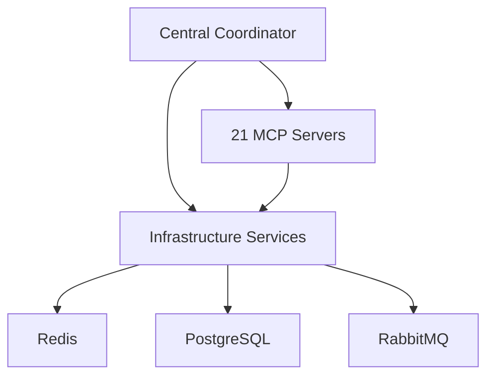

# MCP 21-Server Docker Configuration Plan

## Architecture Overview



## Agent Role Distribution

| Role | Current Count | New Count | Port Range | Description |
|------|--------------|----------|------------|-------------|
| Code Indexers | 2 | 4 | 3101-3104 | Full repo understanding |
| Builders | 2 | 4 | 3121-3124 | Project scaffolding |
| Executors | 2 | 6 | 3136-3141 | Trade execution |
| Coordinators | 2 | 4 | 3151-3154 | System coordination |
| Planners | 2 | 3 | 3161-3163 | Strategic planning |

## Infrastructure Changes

1. **Redis**
   - Memory limit: 2GB
   - Max clients: 1000

2. **PostgreSQL**
   - Max connections: 200
   - Shared buffers: 1GB

3. **RabbitMQ**
   - Mirrored queues enabled
   - Disk space: 10GB

## Configuration Changes

### generate_full_docker_compose.py Updates

```python
AGENT_ROLES = {
    "code_indexers": {
        "count": 4,  # Increased from 2
        "port_start": 3101,
        "description": "Full repo understanding",
        "mcp_paths": ["/app/mcp_servers"]
    },
    # Other roles updated similarly
}
```

## Verification Steps

1. **Startup Test**
   ```bash
   python manage_mcp_orchestration.py start
   ```

2. **Status Check**
   ```bash
   python manage_mcp_orchestration.py status
   ```

3. **Load Testing**
   ```bash
   python performance_test.py --servers 21
   ```

4. **Monitoring**
   - Check Grafana dashboard
   - Verify Prometheus metrics
   - Review Jaeger traces

## Rollout Plan

1. Update configuration files
2. Test in staging environment
3. Deploy to production
4. Monitor for 24 hours
5. Final verification